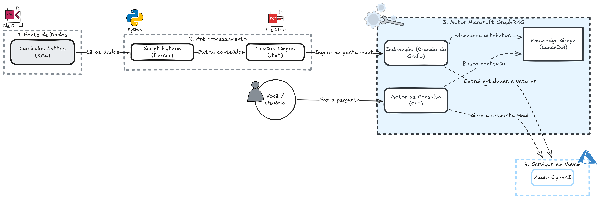

# Lattes GraphRAG

Projeto para preparar dados de curriculos Lattes em texto e indexar com
GraphRAG.

## Diagrama de arquitetura



## Estrutura do repositorio

```text
lattes-graphrag/
  input_xml/                  # XMLs brutos do Lattes
  input/                      # TXTs limpos para o GraphRAG
  prompts/                    # Prompts usados no pipeline GraphRAG
  scripts/
    extract_lattes_text.py    # Extracao + limpeza XML -> TXT
    mapear_grafo.py           # Mapeamento de entidades, relacionamentos e comunidades
  docs/
    fundamentacao_tcc.md      # Fundamentacao academica (objetivo, problema, DSR, PRISMA)
    CONTEXTO_PROJETO.md       # Briefing completo para IAs e modelos
    ingestao_lattes_xml.md    # Documentacao tecnica do pipeline de ingestao
    diagramas/                # Diagramas do projeto (Excalidraw, PNG)
  settings.yaml
  .env
  .env.example
  requirements.txt
```

## Requisitos

- Python 3.10+
- Ambiente virtual ativo
- GraphRAG configurado no `settings.yaml`

Instalacao sugerida:

```bash
pip install -r requirements.txt
```

## Configuracao de ambiente

Crie o arquivo `.env` com base no `.env.example`.

```bash
GRAPHRAG_API_KEY=<sua_chave_azure_openai>
```

## Como gerar os textos a partir do XML

1. Coloque os arquivos XML na pasta `input_xml/`.
2. Execute:

```bash
python scripts/extract_lattes_text.py --input-dir input_xml --output-dir input
```

3. O script cria um `.txt` por XML na pasta `input/`.

## Como rodar o GraphRAG

### 1. Indexacao (construcao do grafo)

Depois de gerar os TXTs na pasta `input/`, rode o indexador para construir o
grafo do conhecimento:

```bash
graphrag index --root .
```

O processo executa as seguintes etapas automaticamente:

- Chunking dos textos (1200 tokens, overlap 100)
- Extracao de entidades (`organization`, `person`, `geo`, `event`) via LLM
- Sumarizacao de descricoes
- Clustering de comunidades
- Geracao de community reports
- Criacao de embeddings (text-embedding-3-small)

Os artefatos sao salvos em `output/` e os embeddings em `output/lancedb/`.

### 2. Consultas ao grafo

Apos a indexacao, utilize os diferentes modos de busca conforme a necessidade:

**Local Search** — busca entidades e relacoes especificas no grafo:

```bash
graphrag query --root . --method local --query "Quais sao as areas de pesquisa do professor X?"
```

**Global Search** — visao agregada usando community reports:

```bash
graphrag query --root . --method global --query "Quais sao os principais temas de pesquisa entre os pesquisadores indexados?"
```

**Drift Search** — busca exploratoria que combina local e global:

```bash
graphrag query --root . --method drift --query "Quais pesquisadores possuem colaboracoes em comum na area de inteligencia artificial?"
```

### Exemplos de perguntas uteis

| Tipo de consulta | Exemplo |
| --- | --- |
| Perfil individual | "Quais as publicacoes mais recentes do pesquisador Y?" |
| Rede de colaboracao | "Quais pesquisadores colaboraram com a instituicao Z?" |
| Mapeamento de area | "Quais sao as principais linhas de pesquisa representadas nos curriculos?" |
| Cruzamento | "Quais pesquisadores atuam simultaneamente em machine learning e saude publica?" |
| Tendencia | "Quais temas de pesquisa ganharam mais publicacoes nos ultimos 5 anos?" |

## Mapeamento do Knowledge Graph

Para gerar tabelas CSV com entidades, relacionamentos e comunidades, alem de
estatisticas gerais do grafo:

```bash
python scripts/mapear_grafo.py
```

Os arquivos sao exportados em `output/tabelas/`:

| Arquivo | Conteudo |
| --- | --- |
| `entidades.csv` | Todas as entidades extraidas (pessoa, organizacao, evento, geo, software) |
| `relacionamentos.csv` | Conexoes entre entidades com peso e descricao |
| `comunidades.csv` | Comunidades detectadas por nivel hierarquico |
| `estatisticas.txt` | Resumo quantitativo do grafo |

## Documentacao adicional

- `docs/CONTEXTO_PROJETO.md` — Briefing completo para transferir contexto a outras IAs/modelos
- `docs/fundamentacao_tcc.md` — Fundamentacao academica (objetivo, pergunta de pesquisa, DSR, PRISMA)
- `docs/ingestao_lattes_xml.md` — Pipeline de ingestao XML
- `docs/diagramas/` — Diagramas de arquitetura e fluxo do projeto
